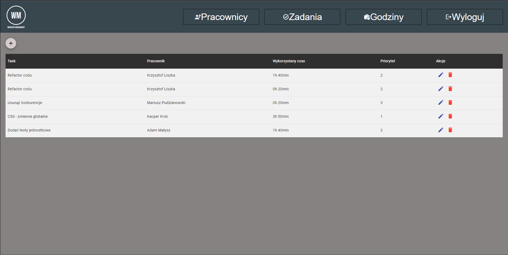
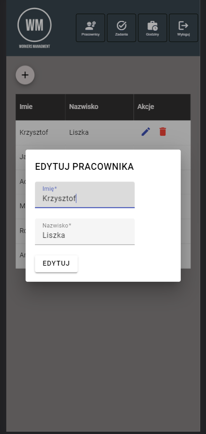

# ZTPAI

### UŻYTE TECHNOLOGIE

- .NET 6.0 WEB API C#
- MS SQL SERVER
- ANGULAR, TYPESCRIPT
- ENTITY FRAMEWORK

### DIAGRAM ERD

### HISTORIA REPOZYTORIUM (PROWADZENIE REPOZYTORIUM)

### ZRZUTY EKRANU Z APLIKACJI

